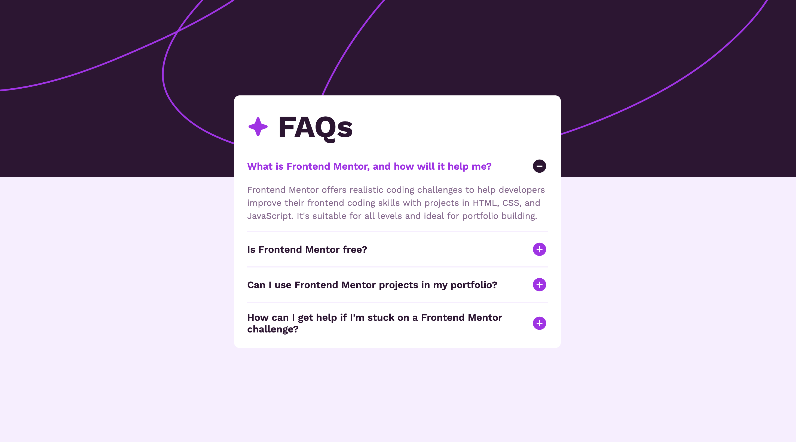

# Frontend Mentor - FAQ accordion solution

This is a solution to the [FAQ accordion challenge on Frontend Mentor](https://www.frontendmentor.io/challenges/faq-accordion-wyfFdeBwBz). Frontend Mentor challenges help you improve your coding skills by building realistic projects.

## Overview

### The challenge

Users should be able to:

- Hide/Show the answer to a question when the question is clicked
- Navigate the questions and hide/show answers using keyboard navigation alone
- View the optimal layout for the interface depending on their device's screen size
- See hover and focus states for all interactive elements on the page

### Screenshot

### Links

- [Solution URL](https://github.com/norwegJan/FAQ-accordion)
- [Live Site URL](https://norwegjan.github.io/FAQ-accordion/)

## My process

### Built with

- Semantic HTML5 markup
- CSS custom properties
- Flexbox
- Mobile-first workflow
- Vanilla JS

### What I learned

- Better understanding of the importance of correct semantic HTML and structure
- Better understanding of correct use of ARIA-attributes, especially aria-expanded and aria-controls
- How to utilise the accessibility tree in the dev tools when testing and checking my sites for (potential) a11y-issues
- How to utilise MacOS' native screen-reader VoiceOver when testing and checking my sites
- A better understanding on how screen-readers work in general

### What I'm proud of

That I learned and got a better understanding on the points mentioned above.

### Useful resources

- [Accordion example on W3.org](https://www.w3.org/WAI/ARIA/apg/patterns/accordion/examples/accordion/) - Useful resource when learning building out accessible acordions.
- [VoiceOver Accessibility Testing](https://medium.com/@natalia.chugaievska/voiceover-accessibility-testing-a-practical-guide-for-designers-db0a8e7b2bfb) - Great guide on how to utilise the VoiceOver screen-reader when testing sites/pages.

### AI Collaboration

- What tools did you use? -> ChatGPT Codex
- How did you use them? -> For mentor and debugging assistance, used with the agent role instruction provided in AGENTS.md

## Author

- Website - [My GitHub Profile](https://github.com/norwegJan)
- Frontend Mentor - [@norwegJan](https://www.frontendmentor.io/profile/norwegJan)
